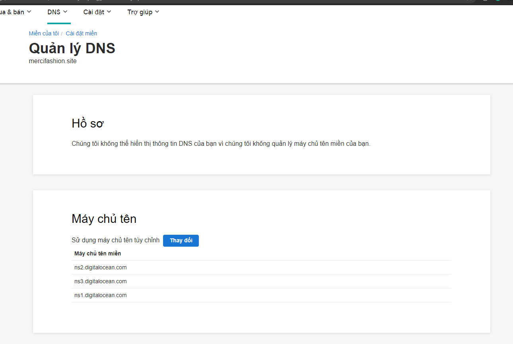
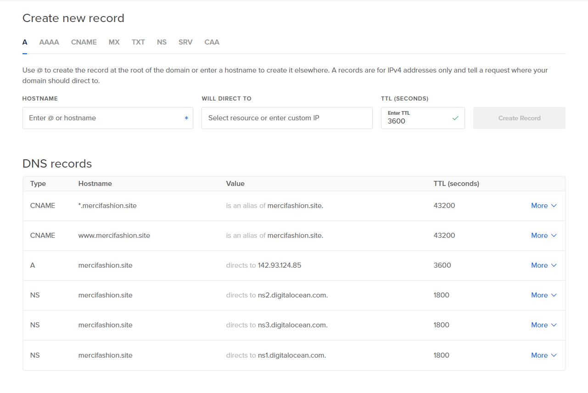

# Deploy-kit

# Mua Tên Miền

nếu mua test thì mua tầm tên miền 20-30k, có một vài cái hay mua

- [Matbao](https://www.matbao.net/) - (giá rẻ và được support tốt, nhưng bị cái là thủ tục lằng nhằng )

- [Nhanhoa](https://nhanhoa.com/) - (giá trung và được support tốt, nhưng bị cái là thủ tục lằng nhằng + mấy con sale nó spam suốt)

- [Godaddy](https://vn.godaddy.com/) - (rẻ + nhanh, nhưng support lâu)
     ### lưu ý
     - tắt gia hạn theo năm (không là năm sau tự nhiên mất tiền)
     - kiểm tra email (lỡ mất không biết đâu mà tìm)

# Trỏ DNS

Thông thường thì có thể skip bước này tại trỏ hay không cũng xài bỉnh thường hà, mục đích của việc trỏ là để sau này tiện hơn khỏi mắc công nhảy qua nhảy lại những cái web khi mà mình xài dịch vụ của nhiều web


ở đây là đang dùng godaddy những muốn trỏ về digital ocean cho dễ xử dụng.

# Config DNS

- 1 Thẻ A trỏ tới IP của vps: mình dùng thẻ này để trỏ vào ip của vps của mình: khi client đăng nhập vào trang web nó sẽ dẫn tới đây rồi từ đây truyền về ip của vps
- 1 Thẻ CNAME (support): mình dùng thể nào để giải thích cho client biết là mình có vài các tên khác nữa vd như (www.hello.com = hello.com) mình khai báo cả hai để nói cho nó biết tất cả là một
     - để thêm một sub domain ta sử dụng: sub1.hello.com hoặc \*.hello.com cho phép tất cả các domain



# Install tool for vps

## Thêm control panel để điều kiển dễ hơn

```json
wget -O install.sh http://www.aapanel.com/script/install-ubuntu_6.0_en.sh && sudo bash install.sh
```

## Cài dos2unix để chuyển file sh về file dos thì server mới dọc được

```json
    apt-get update && apt-get install dos2unix
```

### Cho Phép Chạy file SH (VD letsencrypt.sh )

```json
   chmod +x letsencrypt.sh
```

### Đỗi file dos về Unix (một số shell không chạy được unix)

```json
	dos2unix letsencrypt.sh
```

## Cài Docker-compose

```json
    apt-get update && apt-get install docker-compose
```

# Letsencrypt

<a href="./file/letsencrypt.sh" download>Click to download Letsencrypt.sh</a>


- nhớ chỉnh staging = 1 trước khi test tại, lỡ sai nhiều quá nó block tầm 2 3 ngày sau mới mở được (limit hiện tại là 10 lần trong 24h)
- nếu muốn làm cho nhiều subdomain thì phải letsencrypt từng cái lần đâu tiên rồi sau đó cho bot làm

# Nginx chỉnh điều hướng service

proxy_pass phải chỉnh về đúng với config trong docker

## Config cho single page

```nginx
server {
	listen 80;

	server_name www.heaty566.com heaty566.com;

	location / {
     		return 301 https://www.heaty566.com$request_uri;
	}
}

server {
	listen 443 ssl;
	server_name www.heaty566.com;

	ssl_certificate /etc/letsencrypt/live/heaty566.com/fullchain.pem;
	ssl_certificate_key /etc/letsencrypt/live/heaty566.com/privkey.pem;
	include /etc/letsencrypt/options-ssl-nginx.conf;
	ssl_dhparam /etc/letsencrypt/ssl-dhparams.pem;

	location /.well-known/acme-challenge/ {
		root /var/www/certbot;
	}


	location / {
     		proxy_pass 'http://client:3000';

	}

  	location /api {
      proxy_pass 'http://server:4000/api';
  	}
}

```

## Config cho nhiều page

```nginx
server {
	listen 80;

	server_name www.domain1.heaty566.com domain1.heaty566.com;

	location / {
     		return 301 https://www.domain1.heaty566.com$request_uri;
	}
}

server {
	listen 443 ssl;
	server_name www.domain1.heaty566.com;

	ssl_certificate /etc/letsencrypt/live/domain1.heaty566.com/fullchain.pem;
	ssl_certificate_key /etc/letsencrypt/live/domain1.heaty566.com/privkey.pem;
	include /etc/letsencrypt/options-ssl-nginx.conf;
	ssl_dhparam /etc/letsencrypt/ssl-dhparams.pem;

	location /.well-known/acme-challenge/ {
		root /var/www/certbot;
	}


	location / {
     		proxy_pass 'http://client:3000';

	}

  	location /api {
      proxy_pass 'http://server:4000/api';
  	}
}

server {
	listen 80;

	server_name www.domain2.heaty566.com domain2.heaty566.com;

	location / {
     		return 301 https://www.domain2.heaty566.com$request_uri;
	}
}

server {
	listen 443 ssl;
	server_name www.domain2.heaty566.com;

	ssl_certificate /etc/letsencrypt/live/domain2.heaty566.com/fullchain.pem;
	ssl_certificate_key /etc/letsencrypt/live/domain2.heaty566.com/privkey.pem;
	include /etc/letsencrypt/options-ssl-nginx.conf;
	ssl_dhparam /etc/letsencrypt/ssl-dhparams.pem;

	location /.well-known/acme-challenge/ {
		root /var/www/certbot;
	}


	location / {
     		proxy_pass 'http://client:3001';

	}

  	location /api {
      proxy_pass 'http://server:4001/api';
  	}
}

```

# Docker (cái này phải học thôi)

<a href="./file/docker-compose.yml" download>Click to download Docker Compose</a>
